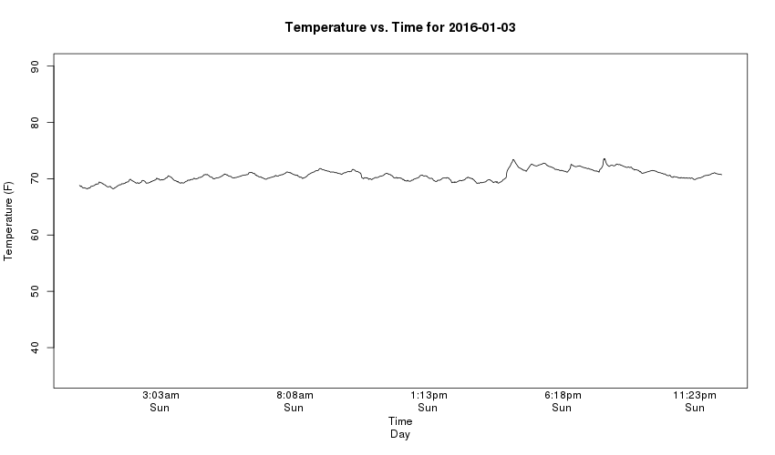
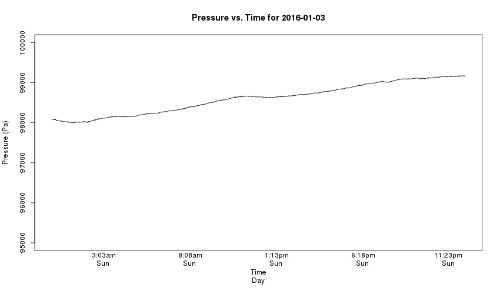
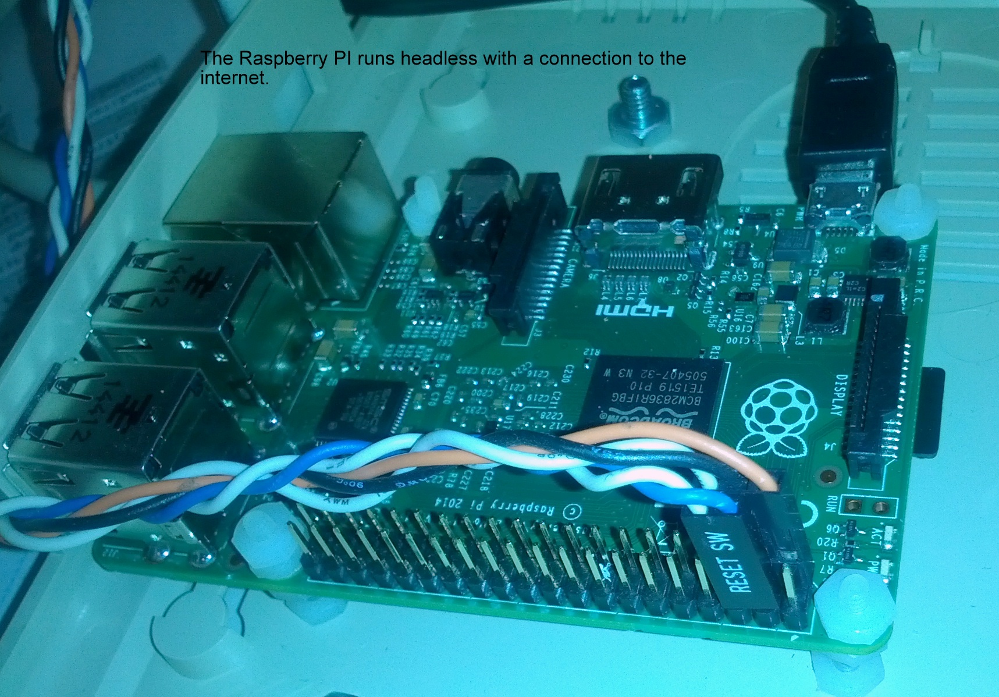
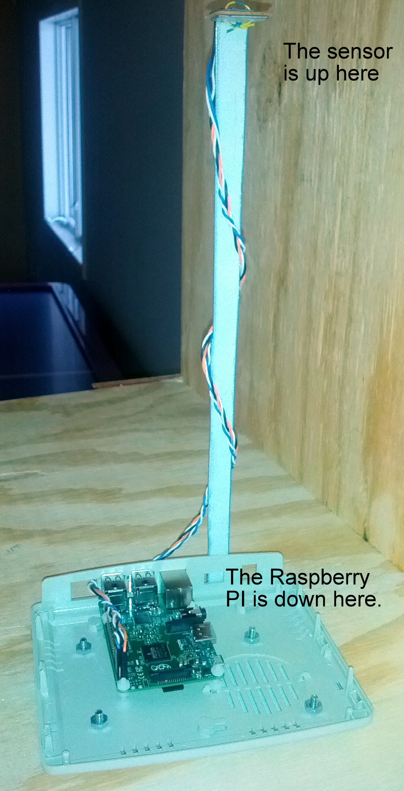
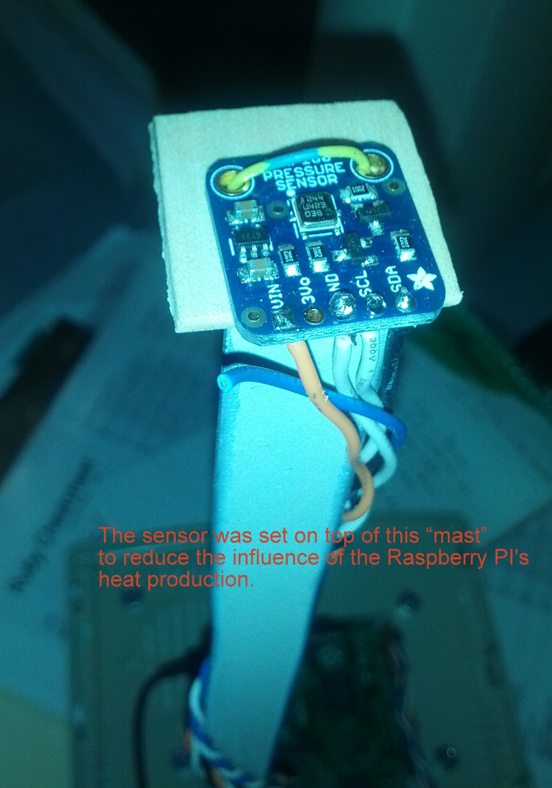

## cottage_watcher (A Erlang app to monitor cottage environment and report as directed)

This erlang application works on the Raspberry PI using the "bmp085" and "erlang_ale" library to interface using I2C to the BMP085 device. The BMP085 device measures both air temperature and air pressure.

The cottage_watcher checks air temperature and air pressure once a minute and records the measurements. After midnight each day, it prepares a report and line plot for each type of measurement and sends it to the destination you define.

It also checks the temperature every minute and will send a warning message the first time the termperature is outside a range you define. If the measurements persist, it sends URGENT messages detailing the temperature problem. If the problem goes away for a period you designate, it will forget any previous out-of-range measurements.

### Initialization

Before you can get air temperatures or pressures, you need to start a process to communicate with the BMP085 device. Call `cottage_watcher:start_link()` and get `{ok, <sensor pid>}`. Use the <sensor pid> value in all your calls to get temperatures and pressures.

### Getting measurements on command

`cottage_watcher:minute_measures(<sensor ID>)` returns a list of 60 tuples. The tuples are the date-time, temperature (Fahrenheit) and the air pressure (Pa).

### The System Specification File

The file contains ERLANG term expressions, like **{max, 12}.**, that set values to control the behavior of the Cottage Watcher applications.

An example of the file is shown below:

```
{min,45}.
{max,80}.
{minutes_to_forget,30}.
{minutes_to_watch_and_escalate, 5}.
{minutes_to_watch_and_escalate_further, 15}.
{url,"http:/beacon.servicelevel.net/
```

### Cottage Beacon

To identify when the power and or internet has gone out at the cottage, we have an HTTP post done to a location that you select. This permits you to run a web application that receives these "posts" and identifies when the time between posts has been too long. The POST transaction sends the temperature, air pressure and the date and time of the post.

By receiving these and storing them, you can check on a regular basis whether the you are not getting the POSTs that mean all is well. YOu control the URL where the POST is done by changing the contents of the System Specification file. 

### Environment

All the development and testing of this software was done on a Raspberry PI model B using Erlang version 18. The sensor was an Adafruit Bosch BMP180 pressure sensor. The software environment for this implementation requires "mutt" to send email messages with attachments and the R language so that we can run an R script to create the line plot attached to the emails we send.

### Examples

An example of the results for a daily temperature report




An example of the results for a daily temperature data file


An example of the results for a daily pressure report



### The Hardware Arrangement

It's a headless Raspberry PI with the only connections being the power supply, an RJ-45 cable to my internet and the wires connecting to the sensor.



A look at the whole Cottage Watcher shows the Raspberry PI at the bottom and the sensor held away from the PI so that the PI doesn't influence the measurements.



A look at the sensor at the top of the "mast" shows the sensor on a little board from Adafruit with four wires soldered on and connected to pins on the Raspberry PI board.


